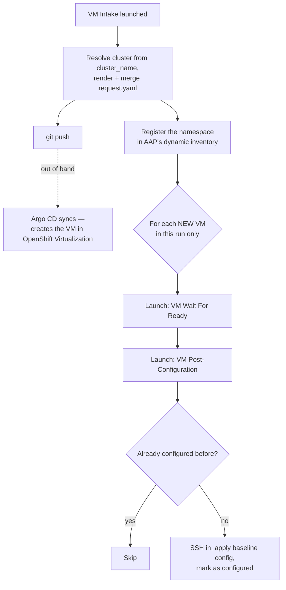

# OCP Virt GitOps + AAP Day-2 Pipeline

Git-driven VM provisioning on OpenShift Virtualization: a request file
describes one or more VMs, Argo CD creates them, and AAP Controller waits
for each new VM to actually be reachable and then configures it — exactly
once, even if the guest reboots or the same group gets a new VM added later.

Target platform: OpenShift 4.20 with OpenShift Virtualization, Argo CD
(OpenShift GitOps operator), and AAP 2.5 (Controller).

## How it flows



One Job Template (**VM Intake**) does the git push *and* orchestrates the
rest by launching two more Job Templates per new VM. Argo CD's part is
completely decoupled — it just reacts to the commit.

## Repository layout

```
argocd/
  applicationset-vm-requests.yaml   # Git file generator, watches requests/**/*.yaml
  registered-clusters.yaml          # cluster_name -> Argo CD destination map
charts/vm-request/                  # one shared chart every request renders through
  values.yaml                       # size tiers, golden image, per-cluster bridges: map
  templates/
    networkattachmentdefinition.yaml  datavolume.yaml  virtualmachine.yaml
requests/<group-name>/request.yaml  # what a user actually submits (via VM Intake)
docs/request-schema.md              # full field reference
ansible/
  playbooks/
    intake_create_vm_request.yml    # VM Intake - front door + orchestrator
    wait_for_vm_ready.yml           # VM Wait For Ready
    postconfig.yml                  # VM Post-Configuration
    tasks/wait_and_configure_vm.yml # glue: launches the two above, per new VM
  aap-config/configure_controller.yml  # scripts most of "Setting up Controller" below
  roles/{bluecat,netbox}/           # IPAM backends - not the tested path, see "Not built yet"
aap/
  rbac/vm-inventory-serviceaccount.yaml  # ServiceAccount + RBAC, apply per target cluster
  credential-types/create-git-push-token-type.sh
```

## Request file (brief — full reference in `docs/request-schema.md`)

A submitter only ever provides `cluster_name` — never Argo CD's own
destination name:

```yaml
group_name: group-3               # becomes requests/group-3/
cluster_name: cluster-fq2h5        # the only cluster input
namespace: vm-example-3
ssh_key: "ssh-ed25519 AAAA..."
networks:
  - { name: vlan-1415, vlanID: 1415 }
vms:
  - { name: test-vm-1, size: small, network: vlan-1415 }
    # ip omitted -> DHCP (the current, tested default)
```

`VM Intake` resolves `cluster_name` to Argo CD's real destination name via
`argocd/registered-clusters.yaml`, and writes both fields into the
committed `request.yaml` — Argo CD's Git file generator needs the raw
`cluster` key in the file itself, it just isn't something anyone types.

**IP addressing today is DHCP.** Every VM gets a real VLAN interface either
way; omitting `vms[].ip` just means that interface is DHCP- instead of
statically-addressed. Static IP via NetBox/BlueCat IPAM (`use_ipam: true`,
`ansible/roles/{netbox,bluecat}`) exists in code but isn't the tested path —
see "Not built yet."

## Setting up AAP Controller

Run `ansible/aap-config/configure_controller.yml` to create all of this
automatically (idempotent, safe to re-run) — see the playbook's own header
for the exact command. It can't create real secret values, and can't run as
a Controller Job Template on its first execution (it's what creates the
Project/Job Templates), so a few things are still manual the first time:

**Credential Type** — `Git Push Token` (the built-in GitHub PAT type has no
injector, so it never reaches the playbook). Script:
`aap/credential-types/create-git-push-token-type.sh`.

**Credentials:**

| Name | Type | Backs |
|---|---|---|
| `git-push-token` | Git Push Token (custom) | Pushing `request.yaml` back to git |
| `vm-ssh-key` | Machine | SSH into VMs for post-config. Public half must be passed as every launch's `ssh_key` |
| `openshift-<cluster_name>` | OpenShift/Kubernetes API Bearer Token | Cluster API access — one per cluster, backed by `aap/rbac/vm-inventory-serviceaccount.yaml` applied **on that cluster** |
| `controller-api` | Red Hat Ansible Automation Platform | Lets VM Intake manage its own Inventory objects |
| `bluecat-api` | Machine | Skipped for now — only needed once `use_ipam: true` is tested |

**Job Templates** (Organization `Default`, Project `VM GitOps Ansible
Content`, Execution Environment `Day 2 EE` on all three):

| Name | Playbook | Credentials | Prompt on launch |
|---|---|---|---|
| VM Intake | `ansible/playbooks/intake_create_vm_request.yml` | `git-push-token`, `controller-api` | Extra variables |
| VM Wait For Ready | `ansible/playbooks/wait_for_vm_ready.yml` | none static | Credentials, Extra variables |
| VM Post-Configuration | `ansible/playbooks/postconfig.yml` | `vm-ssh-key` | Inventory, Credentials, Extra variables |

Credentials are prompted (not statically attached) on the last two
specifically so `openshift-<cluster_name>` can be supplied by name at launch
time — a static attachment can't vary per request, so a different cluster
would silently use the wrong one's credential.

## Onboarding a new cluster

1. **Argo CD**: register the cluster (`argocd cluster add`, or an
   equivalent cluster Secret in `openshift-gitops`), then add a
   `cluster_name: <destination-name>` entry to
   `argocd/registered-clusters.yaml`.
2. **AAP**: apply `aap/rbac/vm-inventory-serviceaccount.yaml` *on that
   cluster*, mint a token, and create an `openshift-<cluster_name>`
   Credential from it.
3. **Chart**: add a `bridges: { <cluster_name>: <physical-network-name> }`
   entry in `charts/vm-request/values.yaml` — a request for a `cluster_name`
   with no entry fails loudly at render time rather than silently reusing
   another cluster's network mapping.
4. **Verify prerequisites already exist on that cluster** (this repo doesn't
   manage or check either): the golden image DataSource
   (`values.yaml`'s `image.dataSourceName`/`dataSourceNamespace`), and the
   OVN bridge mapping matching whatever physical-network name you used in
   step 3.
5. Submit a request with `cluster_name: <your-chosen-identifier>` — nothing
   else changes, no playbook or ApplicationSet edits.

## Design notes worth knowing

- **Namespace sharing is allowed.** The chart doesn't own a Namespace
  object; the Application's `CreateNamespace=true` syncOption creates it
  idempotently, so two request files can safely target the same namespace.
- **Deleting a request file does not delete its VMs.** The ApplicationSet
  sets `preserveResourcesOnDeletion: true` — removing/renaming a file
  orphans what it created rather than tearing it down. To actually remove
  VMs, edit `vms:` in the still-existing file (prune is on for resources
  *within* a live Application) or delete them from the cluster directly.
- **The AAP inventory isn't a live view of the cluster.** It only refreshes
  when a Job Template actually launches against it (`update_on_launch`),
  and `overwrite: true` is what makes that refresh a true mirror rather than
  additive-only.
- **A VM is "ready" only once its guest agent *and* SSH port both respond**
  — the guest agent connecting doesn't guarantee sshd is listening yet.
  `wait_for_vm_ready.yml` checks both.

## Not built yet

- Real baseline-config tasks — `postconfig.yml` currently just proves it
  ran (an SSH login banner + a marker file), not actual OS
  patches/hardening/agents/identity/compliance.
- Static IP via IPAM (`use_ipam: true`, NetBox/BlueCat) — implemented but
  not the tested/default path; DHCP is.
- A deliberate VM decommission flow (today, removing a VM is a manual
  `request.yaml` edit).
- The localnet NAD (`networkattachmentdefinition.yaml`) was written from
  Red Hat docs while the cluster was down and isn't yet live-verified.
</content>
